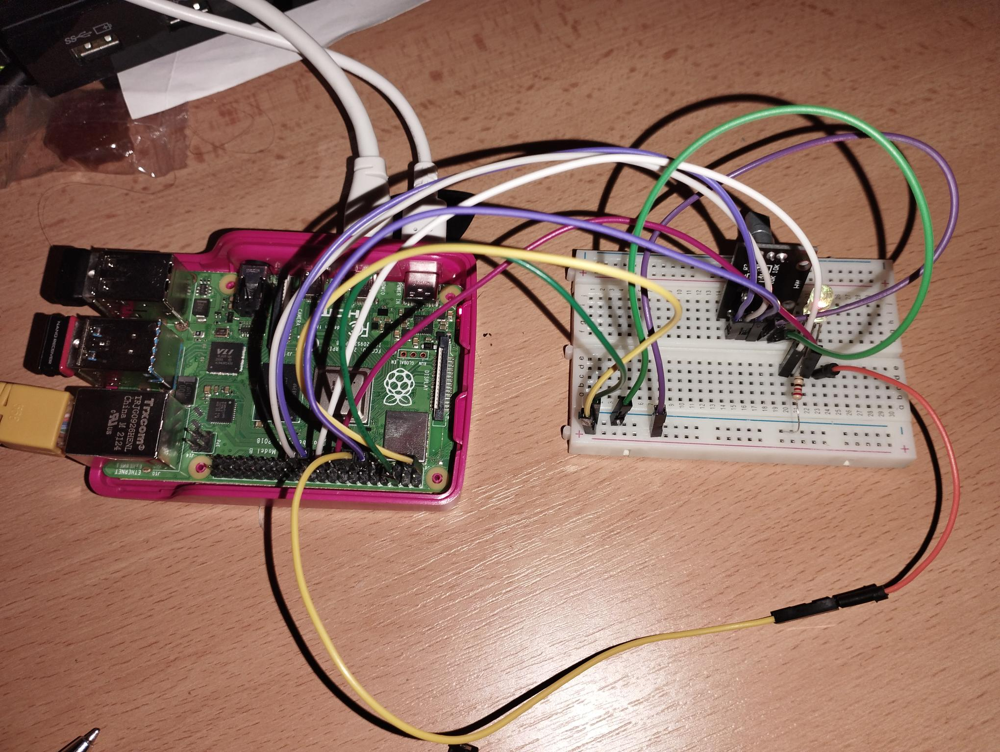

# Raspberry Pi RGB LED Controller with Rotary Encoder

This project demonstrates how to control the color and brightness of a 4-legged RGB LED using a rotary encoder and a Raspberry Pi. The rotary encoder allows users to adjust the brightness of red, green, or blue color channels individually, and the built-in button lets users toggle between colors.


## Components

- **Raspberry Pi 4** (or any Raspberry Pi model with GPIO support)
- **4-legged RGB LED**
- **Rotary Encoder** with a built-in push-button
- **Resistors** for LED protection (typically 220Ω to 330Ω depending on your LED)
- **Breadboard** and **Jumper Wires** for wiring

## Wiring Diagram

| Pin on Raspberry Pi | Component             | Description                   |
|---------------------|-----------------------|-------------------------------|
| GPIO 10             | Red pin of RGB LED     | PWM control for red channel    |
| GPIO 22             | Green pin of RGB LED   | PWM control for green channel  |
| GPIO 27             | Blue pin of RGB LED    | PWM control for blue channel   |
| GPIO 9              | Rotary Encoder CLK     | Clock pin of rotary encoder    |
| GPIO 11             | Rotary Encoder DT      | Data pin of rotary encoder     |
| GPIO 17             | Rotary Encoder Button  | Button pin of rotary encoder   |
| GND                 | Ground                 | Common ground for all components |

---

## Installation

1. **Set up Raspberry Pi LGPIO Library**:
   - Ensure you have the `RPi.GPIO` library installed:
     ```bash
     pip install rpi-lgpio
     ```

2. **Clone the Repository**:
   - Clone this repository to your Raspberry Pi:
     ```bash
     git clone https://github.com/aulisek/AM_pwm_encoder/
     cd https://github.com/aulisek/AM_pwm_encoder/
     ```

3. **Connected the wires and complete circuit**:
	
	
4. **Run the Program**:
   - Run the Python script:
     ```bash
     python3 second_assignment.py
     ```

## Usage

1. **Rotary Encoder**:
   - Turning the encoder **clockwise** increases the brightness of the currently selected color.
   - Turning the encoder **counterclockwise** decreases the brightness of the currently selected color.

2. **Button**:
   - Pressing the button on the rotary encoder cycles through the primary colors (red, green, and blue).
   - The current color and brightness are displayed in the terminal each time the encoder is rotated or the button is pressed.

3. **PWM Brightness Control**:
   - The program uses PWM to control the brightness of the LED

## Example Output

When you change the brightness or color, the terminal will display something like this:
Color changed to: red Current brightness for red: 25

